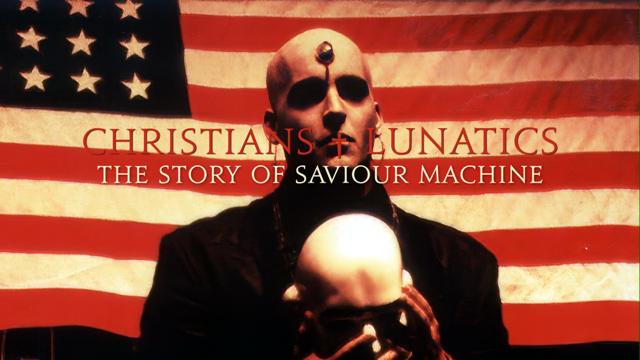

<!DOCTYPE html>
<html lang="en">
<head>
  <meta charset="UTF-8">
  <meta name="viewport" content="width=device-width, initial-scale=1.0">
  <title>CHRISTIANS + LUNATICS – The Story Of Saviour Machine</title>
  
</head>
<body>
  <header class="container">
    
    <h1>CHRISTIANS + LUNATICS - The Story Of Saviour Machine</h1>
    <h2 class="subhead">- A Ten Part Documentary Series By Eric Clayton -</h2>
  </header>
  <main class="container">
    <section class="section">
      
Hello, my friend and welcome to this very special independent film project... 🤘🎬😎🙏

      
The definitive, much‑anticipated Saviour Machine documentary series is here! Ten full‑length episodes released episodically over the next 18 months <strong>Over 12+ hours of exclusive, "never‑before‑seen" footage</strong>

    </section>
    <section class="section">
      <h2>Prelude ▪︎ Overture (1967 – 1987)</h2>
      
Enjoy the free introduction to our story right here:

      
<iframe src="https://media.christians-and-lunatics.com/embed?m=qurUgKmOd" allowfullscreen loading="lazy"></iframe>

    </section>
    <section class="section">
      <h2>Projected Release Schedule</h2>
      
<strong>Episodes 1 – 3</strong> / Summer + Fall 2025

      
<strong>Episodes 4 – 7</strong> / Winter + Spring 2026

      
<strong>Episodes 8 – 10</strong> / Summer + Fall 2026

    </section>
    <section class="section">
      <h2>Episode I ▪︎ Carnival Of Souls (1988 – 1989) ▪︎ Coming in July 2025</h2>
      
<iframe src="https://media.christians-and-lunatics.com/embed?m=TgNpNd1jE" allowfullscreen loading="lazy"></iframe>

      
▪︎ PRE‑ORDER EPISODE I • €18 / $18 ▪︎

    </section>
    <section class="section">
      <h2>Pre‑Order The Complete Documentary (All 10 Episodes)</h2>
      
Secure every episode right now for <strong>€180 / $180</strong>.

      
When you pre‑order the complete series, you will <strong>immediately receive a 25% discount</strong> on the eventual <em>Blu‑Ray box set (2027)</em>.

      
▪︎ PRE‑ORDER ALL TEN EPISODES • €180 / $180 ▪︎

    </section>
    <section class="section">
      
Your support of this unique, independent project is deeply appreciated. By pre‑ordering the complete documentary series and streaming the episodes, you are helping us reach the finish line. 🙏♠️🎬

      
Think of it like paying just <strong>€10/$10 a month</strong> for an exclusive 18‑month journey. 🤘😎

    </section>
    <section class="section">
      
Exclusively through PayPal:

      
<strong>eric.c.huckaby@gmail.com</strong>

      
    </section>
    <footer>
      God bless you, my friend, and thank you again! – Eric Clayton – June 6, 2025
    </footer>
  </main>
</body>
</html>
